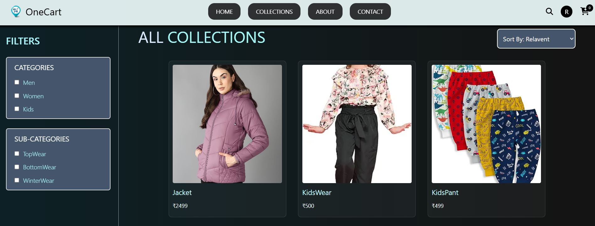
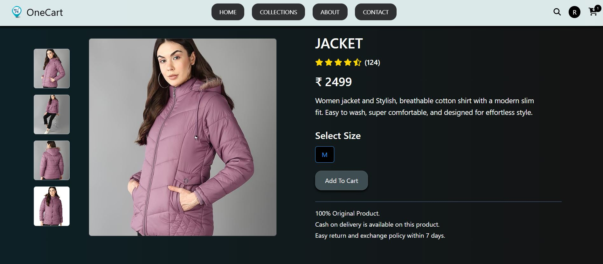
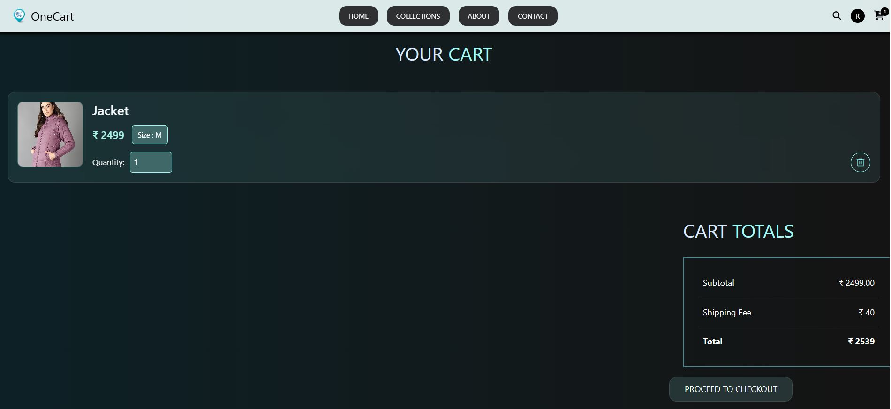

# 🛒 OneCart

A modern full-stack MERN e-commerce platform that provides a seamless online shopping experience with secure authentication, product management, shopping cart functionality, and Razorpay payment integration.

## 🌐 Live Demo

https://onecart-frontend1-5xnl.onrender.com

---

## 🚀 Features

### User Features

* 🔐 Secure Authentication using Firebase & JWT
* 🛍️ Browse Products by Category
* 🔎 Search and Filter Products
* 🛒 Add to Cart & Manage Cart Items
* ❤️ Wishlist Functionality
* 📦 Order Placement & Tracking
* 💳 Secure Online Payments using Razorpay
* 📱 Fully Responsive Design

### Admin Features

* ➕ Add New Products
* ✏️ Update Existing Products
* ❌ Delete Products
* 📦 Manage Customer Orders
* 📊 Inventory Management

---

## 🛠️ Tech Stack

### Frontend

* React.js
* Tailwind CSS
* Axios
* React Router

### Backend

* Node.js
* Express.js

### Database

* MongoDB
* Mongoose

### Authentication

* Firebase Authentication
* JWT (JSON Web Token)
* bcrypt.js

### Payment Gateway

* Razorpay

### Tools

* Git
* GitHub
* Postman

---

## 📂 Project Structure

```bash
OneCart/
│
├── admin/
│   ├── public/
│   │   ├── favicon.svg
│   │   └── icons.svg
│   │
│   ├── src/
│   │   ├── assets/
│   │   ├── component/
│   │   ├── context/
│   │   ├── pages/
│   │   ├── App.jsx
│   │   └── main.jsx
│   │
│   ├── package.json
│   └── vite.config.js
│
├── backend/
│   ├── config/
│   ├── controller/
│   ├── middleware/
│   ├── model/
│   ├── routes/
│   ├── uploads/
│   ├── index.js
│   └── package.json
│
├── frontend/
│   ├── src/
│   │   ├── assets/
│   │   ├── component/
│   │   ├── context/
│   │   ├── pages/
│   │   ├── utils/
│   │   ├── App.jsx
│   │   └── main.jsx
│   │
│   ├── package.json
│   └── vite.config.js
│
├── README.md
└── .gitignore
```
---

## 🔑 Environment Variables

### Backend (.env)

PORT=5000

MONGO_URI=your_mongodb_connection_string

JWT_SECRET=your_jwt_secret

RAZORPAY_KEY_ID=your_razorpay_key_id

RAZORPAY_KEY_SECRET=your_razorpay_key_secret

FIREBASE_PROJECT_ID=your_project_id

FIREBASE_PRIVATE_KEY=your_private_key

FIREBASE_CLIENT_EMAIL=your_client_email

### Frontend (.env)

VITE_FIREBASE_API_KEY=your_api_key

VITE_FIREBASE_AUTH_DOMAIN=your_project.firebaseapp.com

VITE_FIREBASE_PROJECT_ID=your_project_id

VITE_FIREBASE_STORAGE_BUCKET=your_project.appspot.com

VITE_FIREBASE_MESSAGING_SENDER_ID=your_sender_id

VITE_FIREBASE_APP_ID=your_app_id

VITE_RAZORPAY_KEY_ID=your_razorpay_key_id

---

## 📸 Screenshots

### Home Page


### Product Listing Page



### Product Detail Page



### Shopping Cart



---

## 🔄 Application Workflow

1. User signs up or logs in using Firebase Authentication.
2. Products are fetched from MongoDB.
3. Users browse, search, and filter products.
4. Selected products are added to the cart.
5. Users proceed to checkout.
6. Razorpay processes the payment securely.
7. Order details are stored in MongoDB.
8. Users can view their order history and order status.

---

## 🧠 Challenges Faced

* Implementing secure authentication with Firebase and JWT.
* Managing cart state across multiple pages.
* Integrating Razorpay payment gateway.
* Designing scalable MongoDB schemas.
* Creating a responsive UI for all screen sizes.
* Connecting frontend and backend APIs efficiently.

---

## 📚 Key Learnings

* MERN Stack Development
* REST API Design
* Firebase Authentication
* Razorpay Payment Integration
* MongoDB Data Modeling
* State Management in React
* Secure User Authentication & Authorization
* Full-Stack Application Architecture

---

## 👨‍💻 Author

### Raghuveer Singh Panwar

GitHub: https://github.com/Raghuveer222

LinkedIn: https://www.linkedin.com/in/raghuveer-singh-panwar-3864b52a0/

---

⭐ If you like this project, consider giving it a star on GitHub.
